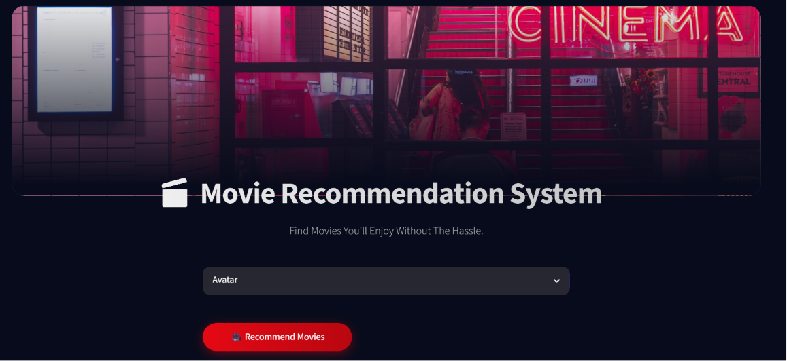
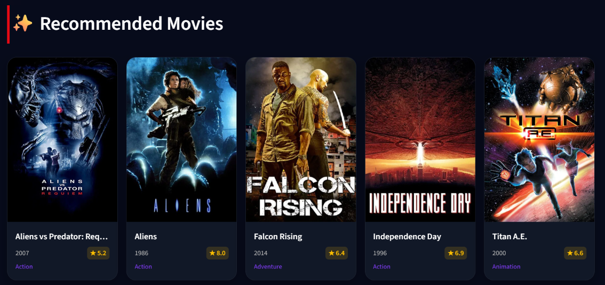

# 🎬 Movie Recommendation System

> Discover your next favorite movie with AI-powered recommendations.

A modern **Movie Recommendation System** built using **Machine Learning**, **Natural Language Processing (NLP)**, and **Content-Based Filtering**. The application recommends **five similar movies** based on the movie selected by the user, using **CountVectorizer** and **Cosine Similarity**.

The project features a beautiful **Streamlit** interface inspired by modern movie streaming platforms and integrates **TMDB movie posters** for an engaging user experience.

---

## 🌟 Live Demo

https://your-app-name.streamlit.app

---

# 📸 Preview

## Home Page




---

## Recommendation Results




---

# 🚀 Features

- 🎥 Recommend Top 5 Similar Movies
- 🔍 Search from Thousands of Movies
- 🧠 AI-Powered Content-Based Recommendation
- 🎭 Uses Movie Genres, Cast, Crew, Keywords & Overview
- 🖼️ Movie Posters from TMDB API
- 📱 Fully Responsive Streamlit UI
- ⚡ Fast Recommendations
- 🎨 Modern Dark Theme Interface

---

# 🛠️ Tech Stack

## Programming Language

- Python

## Machine Learning

- Scikit-learn

## NLP

- CountVectorizer
- Text Preprocessing
- Porter Stemmer

## Recommendation Algorithm

- Cosine Similarity
- Content-Based Filtering

## Frontend

- Streamlit
- Custom CSS

## Dataset

- TMDB 5000 Movies Dataset

---

# 📂 Project Structure

```text
Movie-Recommendation-System/
│
├── app.py
├── movie_list.pkl
├── similarity.pkl
├── tmdb_5000_movies.csv
├── tmdb_5000_credits.csv
├── requirements.txt
├── README.md
├── movie-recommender-system.ipynb
├── movie-rs-screenshot.png
└── movie-rs-screenshot2.png
```

---

# ⚙️ How It Works

The recommendation system follows these steps:

1. Load the TMDB 5000 Movies Dataset.
2. Merge Movies and Credits datasets.
3. Select important features.
4. Perform data preprocessing.
5. Create a Tags column by combining:
   - Overview
   - Genres
   - Keywords
   - Cast
   - Crew
6. Apply text cleaning:
   - Lowercase conversion
   - Remove spaces
   - Remove StopWord by using CV
   - Stemming
7. Convert text into vectors using CountVectorizer.
8. Calculate similarity using Cosine Similarity.
9. Recommend the five most similar movies based on user selection.

---

# 🧠 Machine Learning Workflow

```text
TMDB Dataset
      │
      ▼
Data Cleaning
      │
      ▼
Feature Engineering
      │
      ▼
Tags Creation
      │
      ▼
Text Preprocessing
      │
      ▼
CountVectorizer
      │
      ▼
Vector Matrix
      │
      ▼
Cosine Similarity
      │
      ▼
Top 5 Recommended Movies
```

---

# 📊 Dataset

Dataset Used:

**TMDB 5000 Movie Dataset**

Contains information such as:

- Movie Title
- Overview
- Genres
- Cast
- Crew
- Keywords
- Release Date
- Popularity

---

# 🖥️ Installation

Clone the repository

```bash
git clone https://github.com/yourusername/Movie-Recommendation-System.git
```

Move into the project directory

```bash
cd Movie-Recommendation-System
```

Install dependencies

```bash
pip install -r requirements.txt
```

Run the application

```bash
streamlit run app.py
```

---

# 📦 Requirements

- Python 3.10+
- Streamlit
- NumPy
- Pandas
- Scikit-learn
- NLTK
- Requests
- Pickle

---

# 🎯 Future Improvements

- User Authentication
- Hybrid Recommendation System
- Collaborative Filtering
- Movie Trailer Integration
- Movie Ratings
- Favorite Movies
- Watchlist
- Recommendation History
- Voice Search
- Multi-language Support

---

# 💡 Learning Outcomes

Through this project, I learned:

- Natural Language Processing
- Feature Engineering
- CountVectorizer
- Cosine Similarity
- Content-Based Recommendation Systems
- Data Preprocessing
- Streamlit Application Development
- API Integration
- Git & GitHub Project Management

---

# 👨‍💻 Author

**Ammar Gour**

MCA Student | AI & Machine Learning Enthusiast

---

# ⭐ If you found this project useful

Please consider giving this repository a **Star ⭐**.